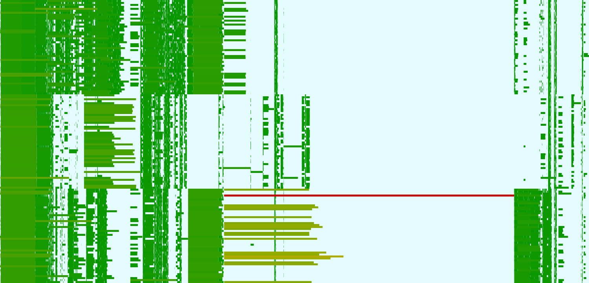

View Spark Timeline
===================

Command line application to visualize the timeline of Spark executions, reading Spark's log files.

A fundamental assumption is that all the executors are added before the Spark application submit jobs.
That is, this tool does not support dynamic scaling.

Installation
------------

.. code-block:: bash

    pip install view-spark-timeline

Example
-------

.. code-block:: bash

    view-spark-timeline -i spark-logs/app-20171115015405-0219 -o docs/example-timeline.svg -u 100

Output:

.. code-block:: text

    Read events from 'spark-logs/app-20171115015405-0219'...
    Total cores: 144
    Total duration: 187.3s
    Number of tasks: 10169
    Min task duration: 0.0s
    Max task duration: 92.2s
    Cluster utilization: 34.84%
    Drawing events...
    Read events from 'spark-logs/app-20171115015405-0219'...
    SVG size: 1500 720
    Saving SVG...

Produced image: `docs/example-timeline.svg <https://github.com/fpoli/view-spark-timeline/blob/master/docs/example-timeline.svg>`_

Image explanation
-----------------

On the vertical axis we have the executor cores (grouped by executor).
On the horizontal axis we have the time, going from left to right.
Each task is a horizontal bar that starts at a certain time on a core of an executor and ends after some time.
The color normally ranges from green, used for shorter tasks, to red, used for longer tasks. Failed tasks are black.
All the white space corresponds to some unused core.

Usually, the greener the image is, the better. If there is a bottleneck in the execution it is easy to spot the guilty task(s).
By opening the SVG in a browser and by moving the mouse over a task there should appear a tooltip with the task ID.
It is then useful to inspect the task using the standard Spark UI.

Usage
-----

.. code-block:: bash

    view-spark-timeline --help

Output:

.. code-block:: text

    usage: view-spark-timeline [-h] -i INPUT_LOG -o OUTPUT_IMAGE
                           [-t TIME_UNCERTAINTY] [-v]

    Visualize the timeline of a Spark execution from its log file. (v0.2.0)

    optional arguments:
    -h, --help            show this help message and exit
    -i INPUT_LOG, --input-log INPUT_LOG
                            path to the spark's application log
    -o OUTPUT_IMAGE, --output-image OUTPUT_IMAGE
                            path of the output image
    -u TIME_UNCERTAINTY, --time-uncertainty TIME_UNCERTAINTY
                            maximum allowed time uncertainty (in ms) of the
                            timestamps in the log file. An high uncertainty
                            determines a slower, but more robust, execution.
                            (Default: 0)
    -v, --version         print version and exit

License
-------

Copyright (c) 2017, Federico Poli <federpoli@gmail.com>

This project, except for files in the `lib` folder, is released under the MIT license.
